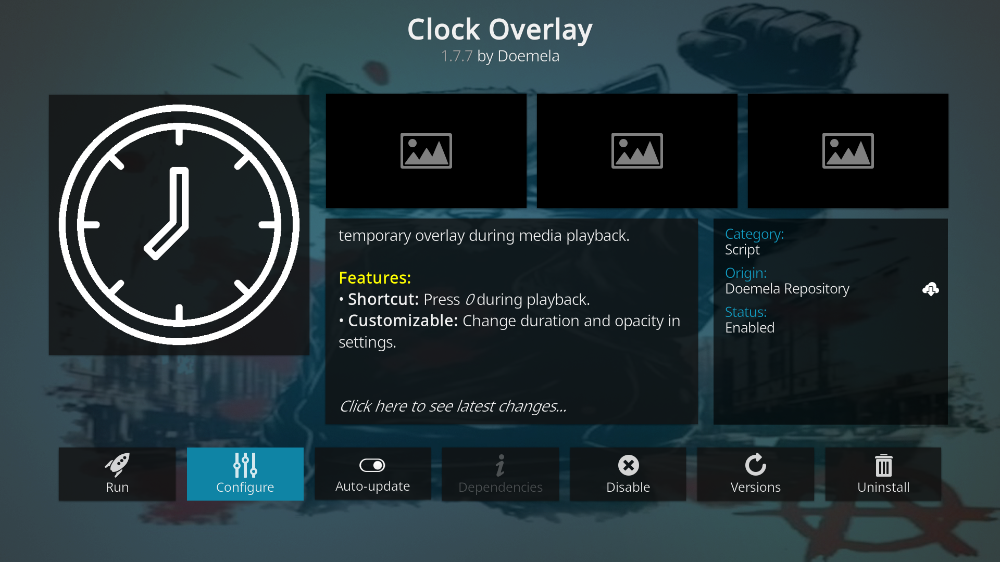

---
# Doemela Kodi Repository
Official repository for **Doemela** Kodi add-ons, specifically optimized for **Kodi 21 (Omega)** and **Raspberry Pi 5**.

## 🚀 Featured Add-ons:
* 🕒 Clock Overlay: A lightweight Python-based clock that displays a temporary overlay during media playback.
* 
*  WireGuard Manager for NordVPN: A lightweight, high-performance Kodi service addon for LibreELEC 12+ (Kodi 21 Omega). This tool manages WireGuard connections natively via connmanctl, providing a faster and more stable experience than traditional OpenVPN-based addons. For detailed instructions for Add-on WireGuard Manager, please visit our **[Wiki](https://github.com/BrodjagaRatnik/service.wireguard.manager/wiki)**
* 

---

## 📖 Quick Links
For detailed instructions for Add-on Clock Overlay, please visit our **[Project Wiki](https://github.com/BrodjagaRatnik/doemela-kodi-repo/wiki)**:

*   **[📥 Installation Guide](https://github.com/BrodjagaRatnik/doemela-kodi-repo/wiki/Installation-Guide)** - How to enable unknown sources and install the repo.
*   **[⌨️ Usage & Shortcuts](https://github.com/BrodjagaRatnik/doemela-kodi-repo/wiki/Usage-%26-Shortcuts)** - Activating the '0' key.
*   **[⚙️ Settings Explained](https://github.com/BrodjagaRatnik/doemela-kodi-repo/wiki/Settings-Explained)** - Tuning the display.
*   **[🆘 Troubleshooting](https://github.com/BrodjagaRatnik/doemela-kodi-repo/wiki/Troubleshooting)** - Fixes for common issues.

For detailed instructions for WireGuard Manager for NordVPN Add-on, please visit our **[Project Wiki](https://github.com/BrodjagaRatnik/service.wireguard.manager/wiki)**:

---

## 📦 Quick Download
If you already know what you're doing, grab the installer here:
[**Download Doemela Repo ZIP**](https://github.com/BrodjagaRatnik/doemela-kodi-repo/tree/main/zips/repository.doemela).

---
*Created by Doemela*
